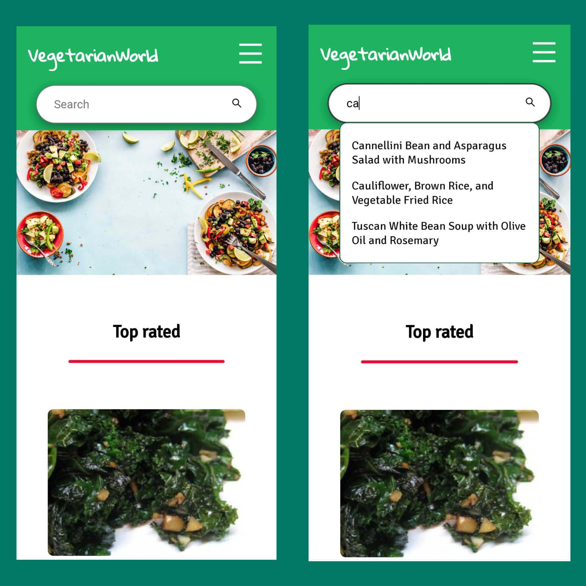
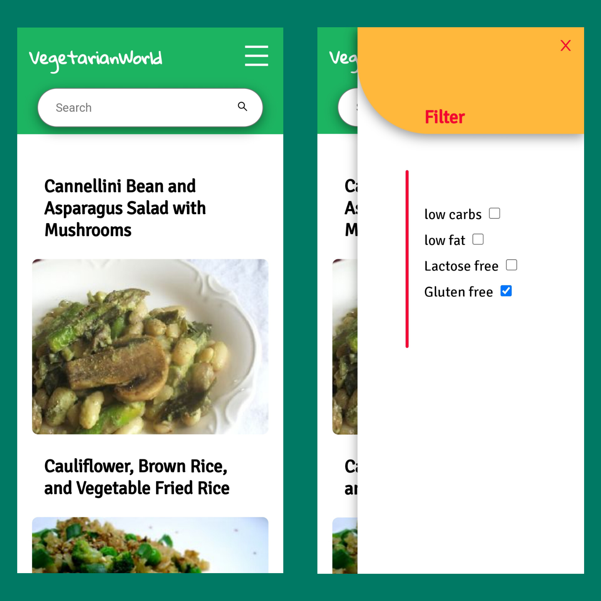
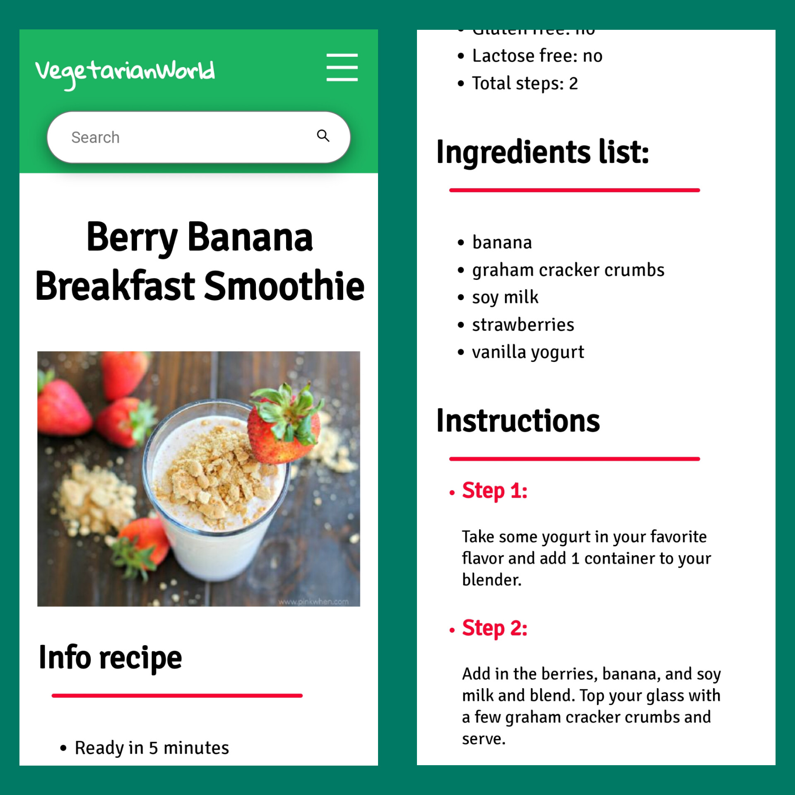
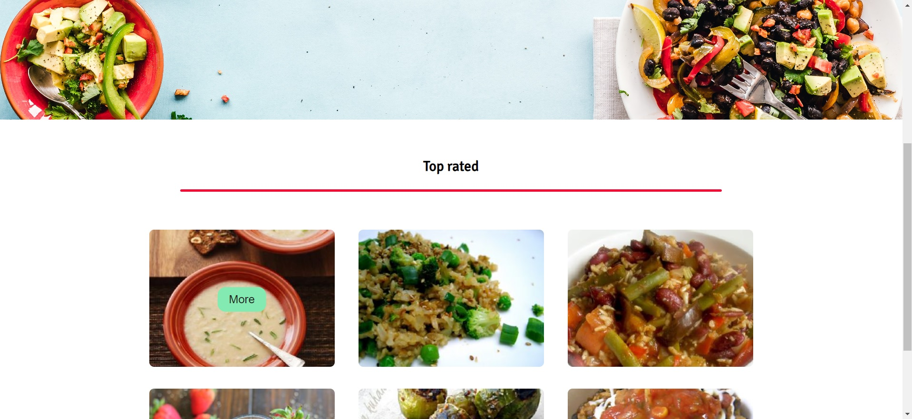
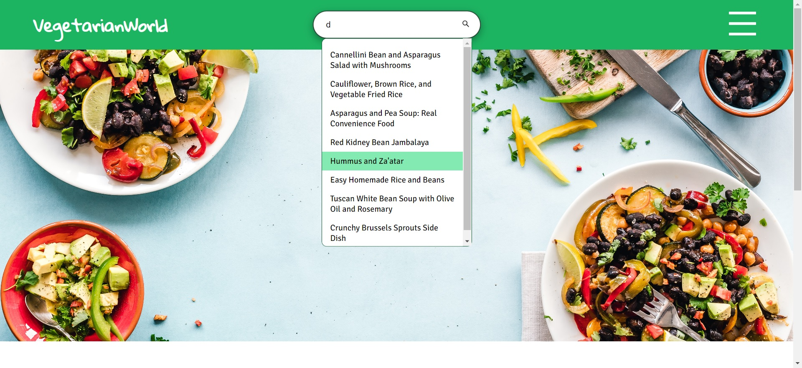
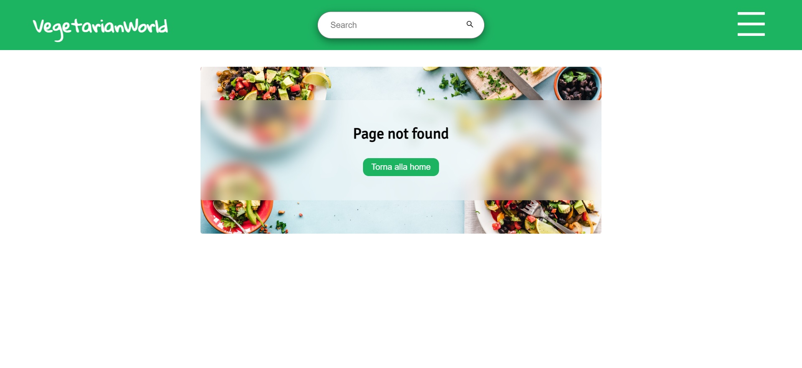
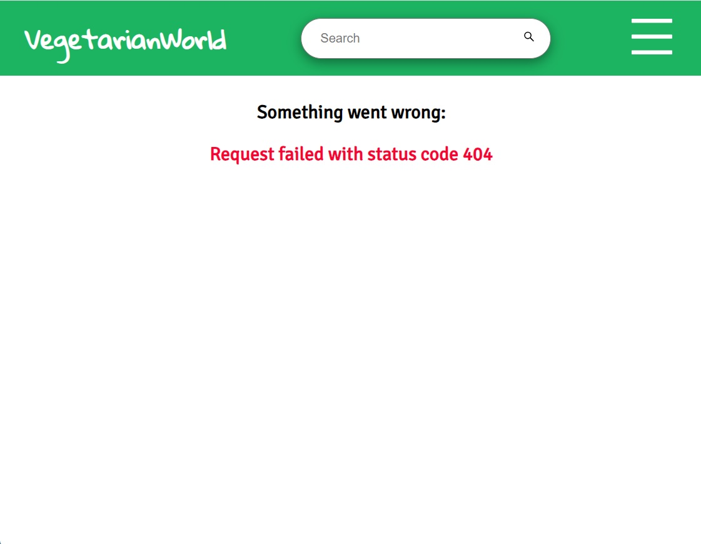

# Web app di ricette vegetariane

## **Prerequisiti:** 

### - Per l'utilizzo:

*  Avere un browser recente ( Chrome, Firefox, Safari...ecc ).

### - Per lo sviluppo, richiede npm:

* Installare tutte le dipendenze tramite `npm`
Creare il proprio account su [_spoonacular_](https://spoonacular.com/food-api/docs) e modificare opportunamente il valore della variabile d'ambiente `ACCESS_TOKEN` presente nel file `src/api/apiFunctions.js`.

Comando di installazione:

    npm install

* In fase di sviluppo può risultare comodo evitare di effettuare troppe richieste al server (visto il limite), quindi è stato predisposto un file `db.json` che è un facsimile del risultato di un fetch. Per poterne usufruire basta lanciare il json-server con il comando `npm`, e modificare opportunamente la variabile globale `URL` nel componente in analisi.

Comando di installazione:

    npm run jsonServer

 

## **Linguaggi e framework utilizzati:** 

* HTML, CSS, JavaScript, React, Redux.

## **Funzioni principali:** 

* Barra di ricerca, con la quale cercare le ricette
* Menù contenente i filtri applicabili
* Descrizione dettagliate ricette

## **Visita la pagina:** 

* ### [_VegetarianWorld_](https://vegetarianworld.netlify.app/)

 

# **Organizzazione dei file:** 

 ## Cartella `./public`

* Contiene `index.html` dove verrà iniettato l'entry point della web app, la `favicon.ico` e il file `_redirects` che reindirizza correttamente il browser in caso di refresch.

 ## Cartella `./src`

* File `index.js` ovvero **l'entry** point dell'app, essa importa un file `index.css` dove sono presenti una serie di variabili globali e renderizza il componente `App`.

* `App.js` contiene l'intera struttura dell'app gestita opportunamente da **React-router**, esso importa il proprio file `App.css` che contiene variabili e classi generiche.

 ## Sotto-cartelle di `./src`:

 ### Cartella **./src/api**:
 * Contiene `apiFunctions.js` che contiene la funzione di **fetch**, accetta due parametri dei quali il primo è obbligatorio: `url` e `params`.

 ### Cartella **./src/img**:
 * contiene le immagini

 ### Cartella **./src/store**:
 * contiene lo store con i reducers

 ### Cartella **./src/actions**:
 * contiene le azioni richiamate dal `dispatch` e la struttura dello **stato globale**

 ### Cartella **./src/Pages**:
 * contiene i componenti che renderizzano le varie pagine, è presente la sotto-cartella `./css` che contiene lo stile di ogni pagina

 ### Cartella **./src/Components**:
 * contiene tutti i componenti, è presente la sotto-cartella `./css` che contiene lo stile di ogni componente.

  

# **Gestione delle pagine:** 

### File principale **App.js**:
 * Si occupa di fare la richiesta principale al sito `spoonacolar` per prelevare l'array contenente le informazioni basilari (titolo e immagine), tale richiesta viene rieffettuata quando i filtri cambiano. Imposta la sezione `top rated` dai dati aggiornati.

 * Renderizza tutte le pagine con React-Router, il componente `<Navbar/>` viene sempre renderizzato

### **Home.js**:
Renderizza la sezione `top rated` prelevando i dati dallo store Redux

### **ResultPage.js**:
Renderizza l'array di dati filtrato dal componente `<Search/>`, mostra titolo e immagine delle ricette.

### **SingleRecipe.js**:
Riceve l'`id` della ricetta cercata e in base a questa effettua una richiesta per ricevere dati specifici. Con l'aiuto di funzioni dedicate viene creato un oggetto da quei dati per consentirne la costruzione grafica.

### **ErrorPage.js**:
Viene mostrata quando React-router non trova corrispondenze tra i "path" preimpostati.

# **Screenshot dell'app:**

## **Vista Mobile**

 

 

 

## **Vista Desktop**

 

 

## **Vista Errori**

 

 

# **Link utili:**

### - [Sito personale (portfolio)](https://giovannipacelli2.github.io/portfolio/)

### - [Link al sito](https://vegetarianworld.netlify.app/)

### - [Breve presentazione](./presentation/Presentazione_Vegetarian_World.pdf)